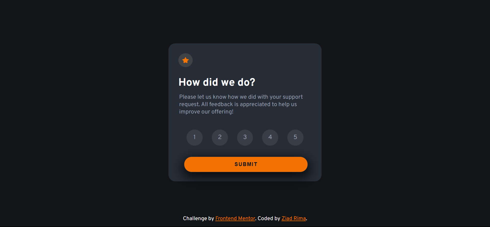

# Frontend Mentor - Interactive rating component solution

This is a solution to the [Interactive rating component challenge on Frontend Mentor](https://www.frontendmentor.io/challenges/interactive-rating-component-koxpeBUmI). Frontend Mentor challenges help you improve your coding skills by building realistic projects. 

## Table of contents

- [Overview](#overview)
  - [The challenge](#the-challenge)
  - [Screenshot](#screenshot)
  - [Links](#links)
- [My process](#my-process)
  - [Built with](#built-with)
  - [What I learned](#what-i-learned)
  - [Continued development](#continued-development)
- [Author](#author)


## Overview

### The challenge

Users should be able to:

- View the optimal layout for the app depending on their device's screen size
- See hover states for all interactive elements on the page
- Select and submit a number rating
- See the "Thank you" card state after submitting a rating

### Screenshot



### Links
- [Solution URL](https://www.frontendmentor.io/solutions/react-interactive-responsive-component-1owsEacuNm)
- [Live Site URL](https://interactiveratingfrontend.netlify.app/)

## My process

For this project, I've chosen to go with React, I set up the necessary environment and installed the required dependencies, then I created a folder named components where I'd be putting all of my individual components.

in `App.jsx`:
```jsx
import Header from "./components/Header"
import Footer from "./components/Footer"

const App = () => {
  return (
    <main className="main-component">
      <Header />
      <Footer />
    </main>
  )
}
export default App
```
- I'm thinking of creating a separate component for `main` as that would give me the opportunity to divide the footer and the main content.
- Actually, I don't have to create a component for `main` I can just do:
```jsx
import Header from "./components/Header"
import Footer from "./components/Footer"
const App = () => {
  return (
    <>
      <main className="main-component">
        <Header />
      </main>
      <Footer />
    </>
    
  )
}
export default App
```
This is how I coded the `Header.jsx` component:
```jsx
import star from '../assets/images/icon-star.svg'
const Header = () => {
  return (
    <header className='header'>
      
      <h1 className='header-title'>How did we do?</h1>
    </header>
  )
}
export default Header
```

After creating the `Ratings.jsx` and `Rating.jsx` components, which were coded like this:

`Ratings.jsx`:
```jsx
import Rating from "./Rating"
const Ratings = () => {
  return (
    <div className="ratings-component">
        <Rating>
            <p className="rating">1</p>
        </Rating>
        <Rating>
            <p className="rating">2</p>
        </Rating>
        <Rating>
            <p className="rating">3</p>
        </Rating>
        <Rating>
            <p className="rating">4</p>
        </Rating>
        <Rating>
            <p className="rating">5</p>
        </Rating>
    </div>
  )
}
export default Ratings
```
`Rating.jsx`:
```jsx
const Rating = ({children}) => {
  return (
    <div className="rating-item">
      {children}
    </div>
  )
}
export default Rating
```
I realized that the user should click one of the ratings, and after doing so, the background color of that particular rating should be set to `var(--Orange)`, so I decided to change the code for those two components using the `useState()` hook.

- In `Ratings.jsx`, I declared a state variable `selectedRating` and its corresponding state updater function `setSelectedRating` using React's `useState` hook. Initially, the `selectedRating` state is set to `null`:
```jsx
const [selectedRating, setSelectedRating] = useState(null);    
const handleRatingClick = (rating) => {
    setSelectedRating(rating)
};
```
- Then I used `map()` function to map over the elements of an array consisting of numbers from '1' to '5', then I passed each number as a `rating` variable to `Rating.jsx` component, along with `key`, `isSelected` and `onClick` function as props, where `isSelected` acts as a boolean to check whether or not a certain "rating" (or number) has been selected and the `onClick` function that calls `handleRatingClick` function to set the `selectedRating` to `rating`:
```jsx
{[1,2,3,4,5].map((rating) => (
    <Rating 
      key={rating} 
      isSelected={selectedRating === rating}
      onClick= {() => handleRatingClick(rating)}
    >
      <p className="rating">{rating}</p> 
    </Rating>
))}
``` 
- After that, I modified the `Rating.jsx` component to accept the props passed and use them according to the intended logical process:
```jsx
const Rating = ({children, isSelected, onClick}) => {
  return (
    <div className={`rating-item ${isSelected ? "selected" : ""}`}
         onClick={onClick}
    >
      {children}
    </div>
  )
}
export default Rating
```
I used a ternary operation to set the second class name for the rating item (which is the number in this case), based on whether or not that particular number has been selected. By using `isSelected` boolean, the `className` can be either `rating-item selected` if the number has been selected or just `rating-item` if the number has not been selected, I modified the `index.css` accordingly:
```css
.ratings-component .rating-item.selected {
    background-color: var(--Orange);
    color: var(--Very-Dark-Blue);
}
```

I faced difficulties when trying to pass the same `selectedRating` to another component, which is `Selection.jsx` component, I've done some research on how to do it, one of the solutions was to move the `selectedRating` to a parent component (i.e., the `App.jsx` component). Then, pass it as a prop to both the `Ratings.jsx` component and the `SecondPage.jsx` component which will in turn pass it to `Selection.jsx`:

- I modified `App.jsx`:
```jsx
const [selectedRating, setSelectedRating] = useState(null);
  return (
    <>
      <main className="main-component">
        <Header />
        <Content />
        <Ratings selectedRating={selectedRating} setSelectedRating={setSelectedRating}/>
        <SubmitButton />
      </main>
      <div className="thankyou-component">
        {selectedRating && <SecondPage selectedRating={selectedRating}/>}
      </div>
      <Footer />
    </> 
  )
```
- `Ratings.jsx`:
```jsx
const Ratings = ({ selectedRating, setSelectedRating }) => {
  const handleRatingClick = (rating) => {
      setSelectedRating(rating)
  }
  return (
    <div className="ratings-component">
      {[1,2,3,4,5].map((rating) => (
          <Rating 
            key={rating} 
            isSelected={selectedRating === rating}
            onClick= {() => handleRatingClick(rating)}
          >
            <p className="rating">{rating}</p>       
          </Rating>
      ))}
    </div>
  );
};
```
- `SecondPage.jsx`:
```jsx
import Selection from "./Selection"
import Appreciation from "./Appreciation"
const SecondPage = ({selectedRating}) => {
  return (
    <div className="second-page">
      <Selection selectedRating={selectedRating}/>
      <Appreciation />
    </div>
  )
}
export default SecondPage
```
- `Selection.jsx`:
```jsx
const Selection = ({selectedRating}) => {
  return (
    <div className="selection-content">
      
      <p className="selection-text">You selected {selectedRating} out of 5</p>
    </div>
  )
}
```

I handled the part where the user submits their rating this way:
- `App.jsx`:
```jsx
import Header from "./components/Header"
import Footer from "./components/Footer"
import Content from "./components/Content"
import Ratings from "./components/Ratings"
import SubmitButton from "./components/SubmitButton"
import SecondPage from "./components/SecondPage"
import { useState } from "react"
const App = () => {
  
  const [selectedRating, setSelectedRating] = useState(null);
  const [isSubmitted, setIsSubmitted] = useState(false);

  const handleSubmitButton = () => {
    if (selectedRating) {
      setIsSubmitted(true)
    } else {
      alert("Please select a rating before submitting.")
    }
  };

  return (
    <>
      {!isSubmitted ? (
        <main className="main-component">
          <Header />
          <Content />
          <Ratings selectedRating={selectedRating} setSelectedRating={setSelectedRating}/>
          <SubmitButton onSubmit={handleSubmitButton}/>
        </main>
      ) : (
        <div className="thankyou-component">
          <SecondPage selectedRating={selectedRating}/>
        </div>)
      } 
      <Footer />
    </>
    
  )
}
export default App
```
- `SubmitButton.jsx`:
```jsx
const SubmitButton = ({onSubmit}) => {
  return (
    <div className="submit-button-container">
      <button onClick={onSubmit} className="submit-button" id="submit-button">SUBMIT</button>
    </div>
  )
}
export default SubmitButton
```

### Built with

- HTML (using JSX)
- CSS custom properties
- Flexbox
- [React](https://reactjs.org/) - JS library

### What I learned

I gained a deeper understanding of using props to manage website functionality. Specifically, I learned how to pass a state variable and its corresponding updater function from a parent component to multiple child components.

### Continued development

I'll be focusing on building more React projects in the future as I'm already handling the basics efficiently.

### Useful resources

- [React](https://react.dev/)

## Author

- GitHub - [ziad-rima](https://github.com/ziad-rima)
- Frontend Mentor - [@ziad-rima](https://www.frontendmentor.io/profile/ziad-rima)
- X - [@rima4082](https://x.com/rima4082)
